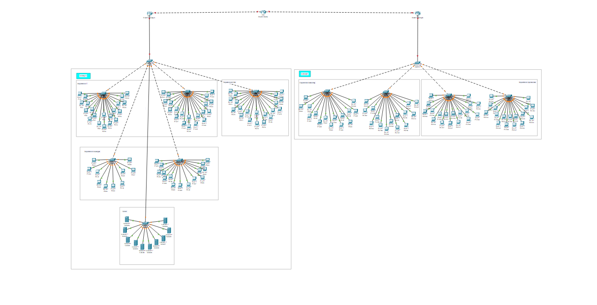

# [Proyek Perancangan & Implementasi Jaringan Enterprise PT. Nusantara Network] - [Pekan 10: Desain Topologi & Skema Pengalamatan] 
### 👥 Daftar Anggota dan Peran

| Nama Anggota     | NIM        | Peran                                        |
|------------------|------------|--------------------------------------------- |
| Az-Zahra Atikah Nurhaliza | 10231022 | Network Architect |
|Chintya | 10221078 | Network Engineer |
| Djaky Abbyyu Fauzan | 10231032 | Network Services Specialist |
| Djaky Abbyyu Fauzan | 10231032 | Network Security & Documentation Specialist | 
## Daftar Isi 
1. [Pendahuluan](#pendahuluan)  
2. [Isi Laporan](#isi-laporan)    
1. [Kendala dan Solusi](#kendala-dan-solusi)  
2. [Kesimpulan](#kesimpulan)  
## **Pendahuluan**  

### **Latar Belakang**  
PT. Nusantara Network merupakan perusahaan di bidang teknologi informasi yang memiliki dua lokasi kantor (pusat dan cabang) dengan total 6 departemen dan server farm. Perusahaan membutuhkan infrastruktur jaringan yang aman, terkelola dengan baik, dan mampu mendukung pertumbuhan bisnis di masa depan. Proyek ini bertujuan untuk merancang solusi jaringan enterprise yang mengintegrasikan seluruh konsep jaringan komputer yang telah dipelajari.

### **Tujuan**  
1. Merancang topologi jaringan yang memenuhi kebutuhan bisnis PT. Nusantara Network  
2. Mengimplementasikan segmentasi jaringan menggunakan VLAN  
3. Menyediakan konektivitas antar-gedung melalui WAN dengan routing dinamis (OSPF)  
4. Menerapkan layanan jaringan (DHCP, DNS, NAT) dan keamanan (ACL)  
5. Membangun dokumentasi teknis yang komprehensif  

### **Ruang Lingkup**  
Proyek mencakup:  
- Perancangan topologi fisik dan logis  
- Pembagian subnet dan pengalamatan IP  
- Konfigurasi VLAN, trunking, dan routing antar-VLAN  
- Implementasi OSPF untuk koneksi WAN antar-gedung  
- Penyediaan layanan DHCP, DNS, dan NAT  
- Penerapan Access Control List (ACL)  
- Pengujian end-to-end dan troubleshooting  
 
## Isi Laporan

## Diagram topologi fisik dan logis

#### Router Utama

##### Fungsi dan Peran:
- Router utama adalah komponen inti dari jaringan ini.
- Bertugas melakukan **routing antar VLAN** dan antar **gedung** (A dan B).
- Terhubung langsung ke **cloud** sebagai representasi dari **akses internet** perusahaan.
- Menghubungkan ke **switch layer 2** yang menyambungkan ke seluruh departemen.

Router ini sangat penting karena berfungsi sebagai titik pusat komunikasi antar semua segmen jaringan. Routing antar VLAN dapat dikontrol menggunakan Access Control List (ACL) untuk menentukan siapa yang bisa mengakses apa.

**Penjelasan:**
Topologi jaringan ini terdiri dari dua gedung (Gedung A dan Gedung B) yang masing-masing terkoneksi ke main router pusat. Setiap gedung memiliki main switch yang terhubung ke switch per departemen. Total 5 departemen dibagi ke dalam dua gedung:

- **Gedung A**:
  - Departemen IT (2 switch, 40 PC)
  - Departemen Keuangan (1 switch, 25 PC)
  - Departemen SDM (1 switch, 20 PC)

- **Gedung B**:
  - Departemen Marketing (2 switch, 30 PC)
  - Departemen Operasional (2 switch, 35 PC)

Pusat jaringan juga memiliki switch server yang terhubung ke beberapa perangkat utama seperti server DNS, DHCP, dan File Server.

---

## 2. Tabel Pengalamatan IP

| Subnet | VLAN ID | Nama Departemen     | Jumlah Host | IP Range          | Gateway        |
|--------|---------|---------------------|-------------|-------------------|----------------|
| 1      | 10      | IT                  | 40          | 192.168.10.0/26   | 192.168.10.1   |
| 2      | 20      | Keuangan            | 25          | 192.168.20.0/27   | 192.168.20.1   |
| 3      | 30      | SDM                 | 20          | 192.168.30.0/27   | 192.168.30.1   |
| 4      | 40      | Marketing           | 30          | 192.168.40.0/26   | 192.168.40.1   |
| 5      | 50      | Operasional         | 35          | 192.168.50.0/26   | 192.168.50.1   |
| 6      | 99      | Management & Server | 10          | 192.168.99.0/28   | 192.168.99.1   |

---

## 3. Daftar Perangkat yang Dibutuhkan

| Nama Perangkat             | Jumlah |
|----------------------------|--------|
| Router utama               | 1      |
| Router Gedung A            | 1      |
| Router Gedung B            | 1      |
| Switch utama Gedung A      | 1      |
| Switch utama Gedung B      | 1      |
| Switch departemen IT       | 2      |
| Switch departemen Keuangan | 1      |
| Switch departemen SDM      | 1      |
| Switch departemen Marketing| 2      |
| Switch departemen Operasional| 2   |
| Switch Server              | 1      |
| Server (DNS, DHCP, File)   | 3+     |
| PC Client                  | 150+   |

---

 *4. Rencana Penerapan VLAN*

| VLAN ID | Nama VLAN      | Departemen      | Tujuan Penggunaan                                                                 |
|---------|----------------|-----------------|----------------------------------------------------------------------------------|
| 10      | VLAN_IT        | IT              | Untuk akses administratif, pemeliharaan jaringan, dan internal IT support        |
| 20      | VLAN_KEU       | Keuangan        | Untuk mengakses aplikasi keuangan, laporan akuntansi, dan data transaksi          |
| 30      | VLAN_SDM       | SDM             | Digunakan untuk pengelolaan data karyawan dan sistem HRIS (Human Resource Information System) |
| 40      | VLAN_MARK      | Marketing       | Mendukung aktivitas kampanye digital, sosial media, dan manajemen konten promosi  |
| 50      | VLAN_OPS       | Operasional     | Menyediakan akses ke sistem logistik, pengiriman, dan aktivitas operasional harian|
| 99      | VLAN_MGMT      | Server & Manajemen | VLAN khusus untuk kontrol jaringan, akses manajemen, serta komunikasi antar server internal |