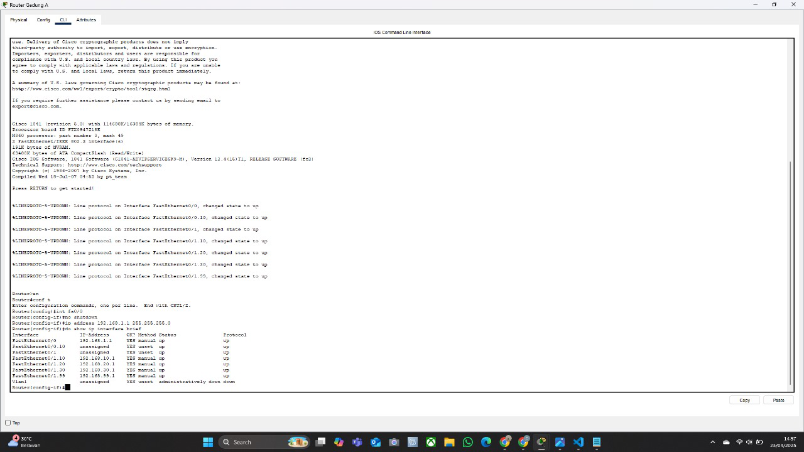
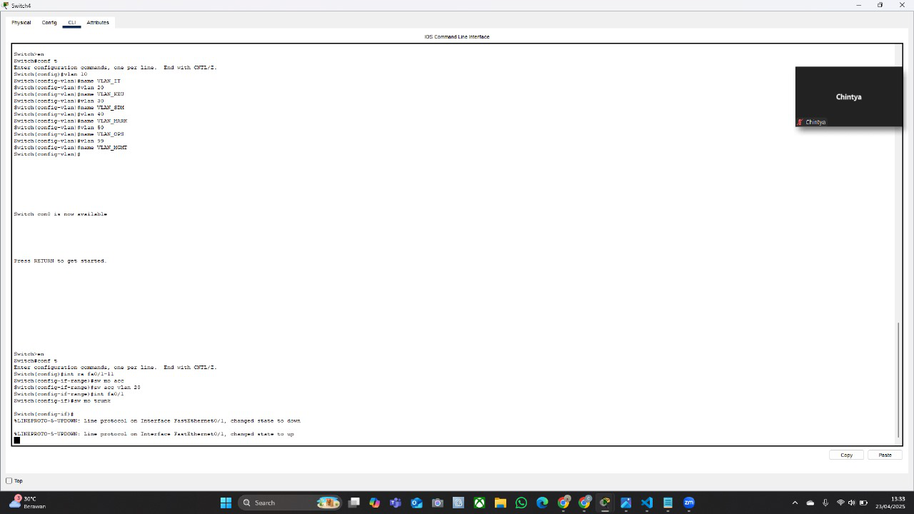
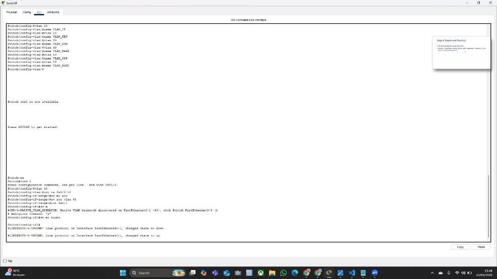
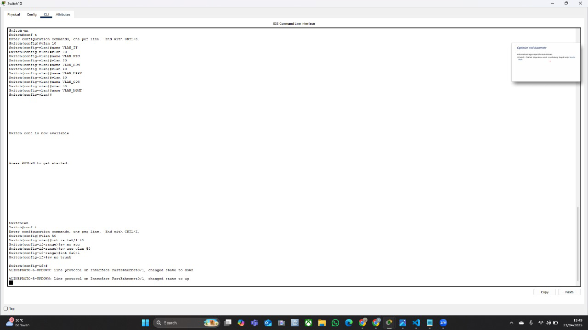
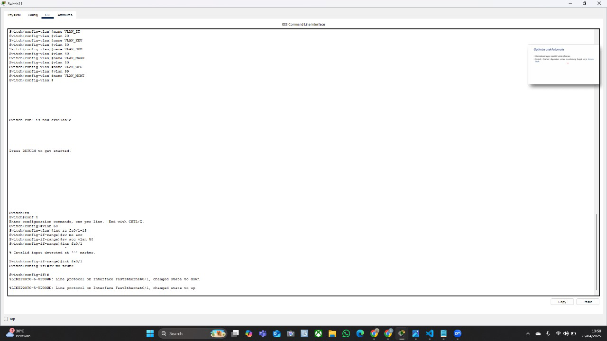

# 📄 Dokumen Perencanaan Proyek  
## Pekan 11 Implementasi Topologi Dasar & VLAN 

---

### 👥 Daftar Anggota dan Peran

| Nama Anggota     | NIM        | Peran                                        |
|------------------|------------|--------------------------------------------- |
| Az-Zahra Atikah Nurhaliza | 10231022 | Network Architect |
|Chintya | 10221078 | Network Engineer |
| Djaky Abbyyu Fauzan | 10231032 | Network Services Specialist |
| Djaky Abbyyu Fauzan | 10231032 | Network Security & Documentation Specialist |

---

## Link file simulasi  
Silahkan unduh file simulasi berikut:

👉 [Topologi week 11.3.pkt - Unduh di sini](https://drive.google.com/drive/folders/1xiroKWWzf1NsEp1NIYw9kMQNoJNFNrB3)


---

## Screenshot Topologi & Penjelasan
Berikut adalah gambar topologi jaringan yang telah diimplementasikan menggunakan Cisco Packet Tracer:


#### Penjelasan
Topologi di atas merupakan implementasi jaringan skala menengah hingga besar yang menggabungkan beberapa VLAN untuk tiap departemen/unit kerja di organisasi. Berikut poin-poin penjelasannya:
1. Struktur Hirarki Jaringan
    - Jaringan terbagi 2 yaitu Gedung a dan Gedung B
    - Masing-masing gedung memiliki beberapa switch distribusi yang terhubung ke switch core (pusat) di tengah jaringan.
2. Pembagian VLAN berdasarkan Departemen
    - Setiap blok (seperti keuangan, SDM, marketing, dll) memiliki switch sendiri yang menghubungkan PC-PC sesuai departemennya.
    - VLAN digunakan untuk memisahkan broadcast domain antar divisi agar jaringan lebih aman dan efisien.
3. Penggunaan Router-on-a-Stick
    - Di tengah jaringan terdapat router yang menghubungkan antar VLAN melalui teknik sub-interface.
    - Router ini bertugas melakukan routing antar VLAN sehingga perangkat dari divisi yang berbeda tetap bisa berkomunikasi.

---

### **Komponen Utama dalam Topologi**

#### **A. Core Router**
- **Fungsi**: Core Router adalah inti dari topologi ini, bertindak sebagai pusat penghubung utama antara kedua gedung dan menyediakan routing antar-VLAN serta koneksi ke Internet.
- **Konfigurasi VLAN**:
  - Core Router memiliki sub-interface untuk masing-masing VLAN.
  - Sub-interface ini digunakan untuk routing antar-VLAN dan mengizinkan komunikasi antar-departemen.
- **Koneksi Trunk**:
  - Core Router terhubung ke **Main Switch A** dan **Main Switch B** menggunakan trunk port (`GigabitEthernet0/0/1`) untuk mendukung semua VLAN yang diperlukan.

#### **B. Main Switch A (Gedung A)**
- **Fungsi**: Main Switch A adalah switch layer 3 yang mengelola semua VLAN di Gedung A.
- **Port Konfigurasi**:
  - Port akses (access ports) dikonfigurasi untuk setiap VLAN sesuai dengan departemen:
    - **VLAN 10**: Departemen IT
    - **VLAN 20**: Departemen Keuangan
    - **VLAN 30**: Departemen SDM
    - **VLAN 40**: Server Farm
  - Port trunk (`FastEthernet0/1`) terhubung ke Core Router untuk mengizinkan semua VLAN melewati koneksi tersebut.
- **VLAN Configuration**:
  - Setiap VLAN telah dibuat dan diberi nama sesuai dengan departemen:
    - VLAN 10: `VLAN_IT`
    - VLAN 20: `VLAN_KEU`
    - VLAN 30: `VLAN_SDM`
    - VLAN 40: `VLAN_SERVER`
```
```
#### **C. Main Switch B (Gedung B)**
- **Fungsi**: Main Switch B adalah switch layer 3 yang mengelola semua VLAN di Gedung B.
- **Port Konfigurasi**:
  - Port akses (access ports) dikonfigurasi untuk setiap VLAN sesuai dengan departemen:
    - **VLAN 50**: Departemen Marketing
    - **VLAN 60**: Departemen Operasional
  - Port trunk (`FastEthernet0/1`) terhubung ke Core Router untuk mengizinkan semua VLAN melewati koneksi tersebut.
- **VLAN Configuration**:
  - Setiap VLAN telah dibuat dan diberi nama sesuai dengan departemen:
    - VLAN 50: `VLAN_MKT`
    - VLAN 60: `VLAN_OPS`

#### **D. Access Switches**
- **Fungsi**: Access Switches digunakan untuk menyediakan koneksi langsung ke perangkat end-user seperti PC di setiap departemen.
- **Port Konfigurasi**:
  - Semua port access switch dikonfigurasi sebagai **access port** untuk VLAN yang relevan.
  - Misalnya:
    - Departemen IT: Semua port di konfigurasi untuk VLAN 10.
    - Departemen Keuangan: Semua port di konfigurasi untuk VLAN 20.
    - Departemen SDM: Semua port di konfigurasi untuk VLAN 30.
    - Departemen Marketing: Semua port di konfigurasi untuk VLAN 50.
    - Departemen Operasional: Semua port di konfigurasi untuk VLAN 60.

#### **E. Server Farm**
- **Fungsi**: Server Farm berisi server-server penting seperti DHCP/DNS Server, Database Server, dan lainnya.
- **Konfigurasi VLAN**:
  - Semua server dalam Server Farm terhubung ke Main Switch A melalui VLAN 40 (`VLAN_SERVER`).


#### **E. Server Farm**
- **Fungsi**: Server Farm berisi server-server penting seperti DHCP/DNS Server, Database Server, dan lainnya.
- **Konfigurasi VLAN**:
  - Semua server dalam Server Farm terhubung ke Main Switch A melalui VLAN 40 (`VLAN_SERVER`).

#### **F. Koneksi Antara Gedung**
- **Trunk Connection**:
  - Koneksi antara **Main Switch A** dan **Core Router**, serta **Main Switch B** dan **Core Router**, menggunakan **trunk port** untuk mendukung semua VLAN yang diperlukan.
  - Ini memungkinkan komunikasi antar-VLAN dan antar-gedung tanpa batasan.

#### **G. NAT (Network Address Translation)**
- **Fungsi**: Core Router juga dilengkapi dengan NAT untuk mengatur koneksi ke Internet.
- **Konfigurasi**:
  - Interface eksternal Core Router (`GigabitEthernet0/0/0`) diatur sebagai NAT outside.
  - Interface internal Core Router (`GigabitEthernet0/0/1`) diatur sebagai NAT inside.
  - Access List (ACL) digunakan untuk mengatur alamat IP yang dapat melakukan NAT.

---

### **3. Implementasi VLAN**
#### **A. Pembagian VLAN Berdasarkan Departemen**
- **Gedung A**:
  - **VLAN 10**: Departemen IT
  - **VLAN 20**: Departemen Keuangan
  - **VLAN 30**: Departemen SDM
  - **VLAN 40**: Server Farm
- **Gedung B**:
  - **VLAN 50**: Departemen Marketing
  - **VLAN 60**: Departemen Operasional

  #### **B. Native VLAN**
- **Native VLAN** adalah VLAN default yang digunakan oleh lalu lintas untagged (untagged traffic). Untuk menghindari konflik native VLAN, ada beberapa hal yang harus di pastikan, yaitu:
  - Port trunk di kedua sisi koneksi memiliki **native VLAN yang sama**.
  - Contoh: Jika port trunk di Main Switch A menggunakan native VLAN 10, maka port trunk di  Switch departemen IT yang terhubung harus juga menggunakan native VLAN 10.

#### **C. Routing Antar-VLAN**
- **Sub-Interface pada Core Router**:
  - Core Router menggunakan sub-interface untuk mendukung routing antar-VLAN.
  - Setiap sub-interface diatur untuk VLAN tertentu, misalnya:
    - `GigabitEthernet0/0/1.10`: VLAN 10
    - `GigabitEthernet0/0/1.20`: VLAN 20
    - `GigabitEthernet0/0/1.30`: VLAN 30
    - `GigabitEthernet0/0/1.40`: VLAN 40
    - `GigabitEthernet0/0/1.50`: VLAN 50
    - `GigabitEthernet0/0/1.60`: VLAN 60


# Konfigurasi Switch - VLAN dan Trunking
DEPARTEMEN OPERASIONAL
## 1. Pembuatan VLAN dan Penamaan
```bash
Switch(config)# vlan 10
Switch(config-vlan)# name VLAN_IT

Switch(config)# vlan 20
Switch(config-vlan)# name VLAN_KEU

Switch(config)# vlan 30
Switch(config-vlan)# name VLAN_SDM

Switch(config)# vlan 40
Switch(config-vlan)# name VLAN_MARK

Switch(config)# vlan 50
Switch(config-vlan)# name VLAN_OPS

Switch(config)# vlan 99
Switch(config-vlan)# name VLAN_MGMT

vlan 50 int ra fa0/1
sw mo acc
sw acc vlan 50
int ra fa0/1
sw mo trunk

Konfigurasi ini bertujuan untuk membuat enam VLAN pada switch, yaitu VLAN 10 hingga VLAN 99, masing-masing mewakili departemen seperti IT, Keuangan, SDM, Marketing, Operasional, dan Manajemen. Setiap VLAN diberi nama sesuai fungsinya, seperti VLAN_IT untuk VLAN 10 dan seterusnya. Setelah itu, port FastEthernet0/1 dikonfigurasikan sebagai port akses untuk VLAN 50 menggunakan mode access. Namun, port yang sama kemudian diubah menjadi mode trunk, yang berfungsi untuk membawa lalu lintas dari beberapa VLAN. Penggunaan mode access dan trunk secara bersamaan pada satu port tidak disarankan karena dapat menyebabkan konflik konfigurasi. Oleh karena itu, perlu dipastikan setiap port memiliki fungsi yang jelas, apakah sebagai akses atau trunk, sesuai kebutuhan jaringan.
```


# Konfigurasi Switch - VLAN dan Trunking
Switch 9
Departemen marketing

```
Kode Konfigurasi
bash
Salin kode
Switch> enable
Switch# configure terminal
Switch(config)# vlan 10
Switch(config-vlan)# name VLAN_IT
Switch(config)# vlan 20
Switch(config-vlan)# name VLAN_KEU
Switch(config)# vlan 30
Switch(config-vlan)# name VLAN_SISWA
Switch(config)# vlan 40
Switch(config-vlan)# name VLAN_TAMU
Switch(config)# vlan 50
Switch(config-vlan)# name VLAN_JADWAL
Switch(config)# vlan 99
Switch(config-vlan)# name VLAN_MGMT
Penjelasan Setiap Perintah
Perintah	Fungsi
enable	Masuk ke mode privileged EXEC.
configure terminal	Masuk ke mode konfigurasi global.
vlan <ID>	Membuat VLAN dengan ID tertentu.
name <NAMA_VLAN>	Memberi nama deskriptif untuk VLAN tersebut.
Daftar VLAN yang Dibuat
VLAN ID	Nama VLAN	Fungsi Umum (Contoh)
10	VLAN_IT	Jaringan untuk tim IT
20	VLAN_KEU	Jaringan bagian keuangan
30	VLAN_SISWA	Untuk akses siswa
40	VLAN_TAMU	Akses jaringan tamu
50	VLAN_JADWAL	Digunakan untuk pengelolaan jadwal
99	VLAN_MGMT	VLAN khusus untuk manajemen switch
```

Switch 8
Departemen Marketing

```bash
Salin
Edit
Switch> enable
Switch# configure terminal

Switch(config)# vlan 10
Switch(config-vlan)# name VLAN_IT

Switch(config)# vlan 20
Switch(config-vlan)# name VLAN_KEU

Switch(config)# vlan 30
Switch(config-vlan)# name VLAN_SISWA

Switch(config)# vlan 40
Switch(config-vlan)# name VLAN_TAMU

Switch(config)# vlan 50
Switch(config-vlan)# name VLAN_MARK

Switch(config)# vlan 60
Switch(config-vlan)# name VLAN_OPS

Switch(config)# vlan 99
Switch(config-vlan)# name VLAN_MGMT
2. Konfigurasi Port VLAN 40
bash
Salin
Edit
Switch(config)# interface range fa0/1 - 16
Switch(config-if-range)# switchport access vlan 40
Artinya: Port FastEthernet 0/1 sampai 0/16 akan masuk ke VLAN_TAMU (VLAN 40).

3. Aktifkan Port dan Mode Trunk
bash
Salin
Edit
Switch(config-if-range)# no shut
Switch(config-if-range)# exit

Switch(config)# interface fastEthernet fa0/1
Switch(config-if)# switchport mode trunk
Penjelasan Perintah

Perintah	Fungsi
vlan <nomor>	Membuat VLAN baru
name VLAN_<nama>	Memberi nama pada VLAN
interface range fa0/1 - 16	Memilih range port dari fa0/1 sampai fa0/16
switchport access vlan 40	Menetapkan VLAN 40 ke port-port yang dipilih
no shut	Mengaktifkan port yang sedang dikonfigurasi
switchport mode trunk	Mengubah port menjadi trunk (untuk membawa banyak VLAN)
Catatan Tambahan
Port fa0/1 masuk VLAN 40 (access), tapi juga dijadikan trunk, ini bisa bikin konflik. Dalam prakteknya, port access dan trunk sebaiknya dibedakan.
```


Konfigurasi Switch7 (VLAN dan Trunk)
Server
 ```
 Konfigurasi VLAN
bash
Salin
Edit
Switch> enable
Switch# configure terminal

Switch(config)# vlan 10
Switch(config-vlan)# name VLAN_IT

Switch(config)# vlan 20
Switch(config-vlan)# name VLAN_KEU

Switch(config)# vlan 30
Switch(config-vlan)# name VLAN_SISWA

Switch(config)# vlan 40
Switch(config-vlan)# name VLAN_TAMU

Switch(config)# vlan 50
Switch(config-vlan)# name VLAN_MARK

Switch(config)# vlan 60
Switch(config-vlan)# name VLAN_OPS

Switch(config)# vlan 99
Switch(config-vlan)# name VLAN_MGMT
2. Konfigurasi Port Access dan Trunk
bash
Salin
Edit
Switch(config)# interface range fa0/1 - 11
Switch(config-if-range)# switchport access vlan 99

Switch(config)# interface range fa0/1 - 11
Switch(config-if-range)# no shutdown

Switch(config)# interface fastEthernet fa0/1
Switch(config-if)# switchport mode trunk
Penjelasan Perintah

Perintah	Fungsi
enable	Masuk ke mode privileged (akses penuh)
configure terminal	Masuk ke mode konfigurasi
vlan <nomor>	Membuat VLAN ID tertentu
name VLAN_<nama>	Memberikan nama pada VLAN
interface range fa0/1 - 11	Memilih port dari fa0/1 sampai fa0/11
switchport access vlan 99	Mengatur port sebagai access VLAN 99 (VLAN_MGMT)
no shutdown	Mengaktifkan port
interface fastEthernet fa0/1	Masuk ke konfigurasi port fa0/1
switchport mode trunk	Mengubah port menjadi trunk, agar bisa membawa banyak VLAN
Catatan Penting
Port fa0/1 diatur sebagai access ke VLAN 99, tapi kemudian juga dijadikan trunk. Ini bisa menimbulkan konflik. Biasanya port trunk sebaiknya dipilih yang berbeda dari port access.

no shutdown penting untuk memastikan interface aktif.
```

Switch 6
Departemen SDM
```
Konfigurasi Switch6 (VLAN dan Trunk)
Konfigurasi VLAN
bash
Salin
Edit
Switch> enable
Switch# configure terminal

Switch(config)# vlan 10
Switch(config-vlan)# name VLAN_IT

Switch(config)# vlan 20
Switch(config-vlan)# name VLAN_KEU

Switch(config)# vlan 30
Switch(config-vlan)# name VLAN_SISWA

Switch(config)# vlan 40
Switch(config-vlan)# name VLAN_TAMU

Switch(config)# vlan 50
Switch(config-vlan)# name VLAN_MARK

Switch(config)# vlan 60
Switch(config-vlan)# name VLAN_OPS

Switch(config)# vlan 99
Switch(config-vlan)# name VLAN_MGMT
Konfigurasi Port Access VLAN dan Trunk
bash
Salin
Edit
Switch(config)# interface range fa0/1 - 21
Switch(config-if-range)# no shutdown
Switch(config-if-range)# switchport access vlan 30

Switch(config)# interface fastEthernet fa0/1
Switch(config-if)# switchport mode trunk
Penjelasan Perintah

Perintah	Fungsi
enable	Mengaktifkan mode privileged (tingkat akses tinggi)
configure terminal	Masuk ke mode konfigurasi
vlan <nomor>	Membuat VLAN dengan ID tertentu
name VLAN_<nama>	Menamai VLAN agar mudah dikenali
interface range fa0/1 - 21	Memilih port dari fa0/1 sampai fa0/21
no shutdown	Mengaktifkan port yang sebelumnya mungkin dalam keadaan mati
switchport access vlan 30	Mengatur port tersebut sebagai access VLAN 30
interface fa0/1	Masuk ke konfigurasi untuk port fa0/1
switchport mode trunk	Mengatur port fa0/1 sebagai trunk agar bisa membawa banyak VLAN
Catatan Tambahan
no shutdown penting untuk memastikan port aktif (up), karena secara default beberapa port bisa dalam kondisi shutdown.

Port fa0/1 digunakan dua kali, sebagai access dan juga trunk. Ini akan menyebabkan konflik jika tidak dikonfigurasi ulang. Biasanya trunk diletakkan di port berbeda (misal fa0/24), bukan port access.
```

Switch 5
Depart Keuangan

```Konfigurasi Switch5 (VLAN & Trunk)
Konfigurasi VLAN
bash
Salin
Edit
Switch> enable
Switch# configure terminal

Switch(config)# vlan 10
Switch(config-vlan)# name VLAN_IT

Switch(config)# vlan 20
Switch(config-vlan)# name VLAN_KEU

Switch(config)# vlan 30
Switch(config-vlan)# name VLAN_SISWA

Switch(config)# vlan 40
Switch(config-vlan)# name VLAN_TAMU

Switch(config)# vlan 50
Switch(config-vlan)# name VLAN_MARK

Switch(config)# vlan 60
Switch(config-vlan)# name VLAN_OPS

Switch(config)# vlan 99
Switch(config-vlan)# name VLAN_MGMT
Konfigurasi Port Access VLAN dan Trunk
bash
Salin
Edit
Switch(config)# interface range fa0/1 - 16
Switch(config-if-range)# switchport access vlan 20

Switch(config)# interface fastEthernet fa0/1
Switch(config-if)# switchport mode trunk
Penjelasan Perintah

Perintah	Fungsi
enable	Masuk ke mode privileged (hak akses lebih tinggi)
configure terminal	Masuk ke mode konfigurasi global
vlan <id>	Membuat VLAN dengan ID tertentu
name VLAN_<nama>	Memberikan nama pada VLAN agar mudah dikenali
interface range fa0/1 - 16	Memilih port dari 1 sampai 16 secara bersamaan
switchport access vlan 20	Menetapkan VLAN 20 sebagai VLAN access untuk port tersebut
interface fa0/1	Masuk ke konfigurasi interface fa0/1
switchport mode trunk	Mengatur interface fa0/1 sebagai trunk untuk membawa banyak VLAN antar switch
Catatan
Pada konfigurasi di atas, fa0/1 digunakan dua kali: untuk access dan trunk. Ini akan konflik jika diterapkan bersamaan di perangkat nyata.

Sebaiknya trunk diletakkan di port yang berbeda dari access (misalnya fa0/24), agar komunikasi antar-switch bisa berjalan baik tanpa konflik.
```

Switch 4
Depart Keuangan

```
Konfigurasi Switch4 (VLAN & Trunk)
Kode Konfigurasi VLAN
bash
Salin
Edit
Switch> enable
Switch# configure terminal

Switch(config)# vlan 10
Switch(config-vlan)# name VLAN_IT

Switch(config)# vlan 20
Switch(config-vlan)# name VLAN_KEU

Switch(config)# vlan 30
Switch(config-vlan)# name VLAN_SISWA

Switch(config)# vlan 40
Switch(config-vlan)# name VLAN_TAMU

Switch(config)# vlan 50
Switch(config-vlan)# name VLAN_MARK

Switch(config)# vlan 60
Switch(config-vlan)# name VLAN_OPS

Switch(config)# vlan 99
Switch(config-vlan)# name VLAN_MGMT
Konfigurasi Port Access dan Trunk
bash
Salin
Edit
Switch(config)# interface range fa0/1 - 11
Switch(config-if-range)# no shutdown
Switch(config-if-range)# switchport access vlan 20

Switch(config)# interface fastEthernet 0/1
Switch(config-if)# switchport mode trunk
Catatan: Baris konfigurasi trunk di atas seharusnya digunakan pada interface yang berbeda dari port access (misalnya fa0/24) agar tidak tumpang tindih. Tapi dalam gambar, fa0/1 digunakan dua kali: untuk VLAN access dan trunk. Ini perlu disesuaikan jika dalam praktik nyata.

Penjelasan Singkat

Perintah	Fungsi
enable	Masuk ke mode privileged
configure terminal	Masuk ke mode konfigurasi global
vlan <id>	Membuat VLAN
name VLAN_<nama>	Menamai VLAN agar mudah dikenali
interface range fa0/1 - 11	Memilih beberapa port (1 sampai 11) sekaligus
no shutdown	Mengaktifkan port
switchport access vlan 20	Menetapkan VLAN 20 ke port tersebut
interface fa0/1	Masuk ke interface untuk konfigurasi tambahan
switchport mode trunk	Mengatur mode trunk agar bisa membawa banyak VLAN
```


SWITCH 3
Depart IT

```
Konfigurasi Switch3 (VLAN & Trunk)
Kode Konfigurasi VLAN
bash
Salin
Edit
Switch> enable
Switch# configure terminal

Switch(config)# vlan 10
Switch(config-vlan)# name VLAN_IT

Switch(config)# vlan 20
Switch(config-vlan)# name VLAN_KEU

Switch(config)# vlan 30
Switch(config-vlan)# name VLAN_SISWA

Switch(config)# vlan 40
Switch(config-vlan)# name VLAN_TAMU

Switch(config)# vlan 50
Switch(config-vlan)# name VLAN_MARK

Switch(config)# vlan 60
Switch(config-vlan)# name VLAN_OPS

Switch(config)# vlan 99
Switch(config-vlan)# name VLAN_MGMT
Konfigurasi Port Access dan Trunk
bash
Salin
Edit
Switch(config)# interface range fa0/1 - 16
Switch(config-if-range)# switchport access vlan 40
Switch(config-if-range)# no shutdown

Switch(config)# interface fastEthernet 0/1
Switch(config-if)# switchport mode trunk
Penjelasan Singkat

Perintah	Fungsi
enable	Masuk ke mode privileged
configure terminal	Masuk ke mode konfigurasi global
vlan <id>	Membuat VLAN baru
name VLAN_<nama>	Memberi nama VLAN
interface range fa0/1 - 16	Memilih port 1 sampai 16
switchport access vlan 40	Menetapkan VLAN 40 ke port tersebut
no shutdown	Mengaktifkan port
interface fastEthernet 0/1	Masuk ke konfigurasi interface tertentu
switchport mode trunk	Mengatur interface menjadi trunk (untuk bawa semua VLAN)
```

Switch 2
Depart IT

```
Konfigurasi VLAN dan Trunking di Switch2
Kode Konfigurasi VLAN
bash
Salin kode
Switch> enable
Switch# configure terminal

Switch(config)# vlan 10
Switch(config-vlan)# name VLAN_IT

Switch(config)# vlan 20
Switch(config-vlan)# name VLAN_KEU

Switch(config)# vlan 30
Switch(config-vlan)# name VLAN_SISWA

Switch(config)# vlan 40
Switch(config-vlan)# name VLAN_TAMU

Switch(config)# vlan 50
Switch(config-vlan)# name VLAN_MARK

Switch(config)# vlan 60
Switch(config-vlan)# name VLAN_OPS

Switch(config)# vlan 99
Switch(config-vlan)# name VLAN_MGMT
Konfigurasi Port Access dan Trunk
bash
Salin kode
Switch(config)# interface range fa0/1 - 21
Switch(config-if-range)# no shutdown

Switch(config-if-range)# switchport mode access
Switch(config-if-range)# switchport access vlan 10

Switch(config)# interface fastEthernet 0/1
Switch(config-if)# switchport mode trunk
```

Router Utama 
```
#### *A. Core Router*
- *Fungsi*: Core Router adalah inti dari topologi ini, bertindak sebagai pusat penghubung utama antara kedua gedung dan menyediakan routing antar-VLAN serta koneksi ke Internet.
- *Konfigurasi VLAN*:
  - Core Router memiliki sub-interface untuk masing-masing VLAN.
  - Sub-interface ini digunakan untuk routing antar-VLAN dan mengizinkan komunikasi antar-departemen.
- *Koneksi Trunk*:
  - Core Router terhubung ke *Main Switch A* dan *Main Switch B* menggunakan trunk port (GigabitEthernet0/0/1) untuk mendukung semua VLAN yang diperlukan.
  ```


Router gedung A
```
📄 Kode Konfigurasi
shell
Copy code
Router>enable
Router#conf t
Router(config)#int fa0/0
Router(config-if)#no shutdown
Router(config-if)#exit

Router(config)#int fa0/0.10
Router(config-subif)#encapsulation dot1Q 10
Router(config-subif)#ip address 192.168.1.1 255.255.255.0
Router(config-subif)#exit

Router(config)#int fa0/0.11
Router(config-subif)#encapsulation dot1Q 11
Router(config-subif)#ip address 192.168.11.1 255.255.255.0
Router(config-subif)#exit

Router(config)#int fa0/0.99
Router(config-subif)#encapsulation dot1Q 99
Router(config-subif)#ip address 192.168.99.1 255.255.255.0
Router(config-subif)#exit

Router(config)#ip dhcp pool vlan10
Router(dhcp-config)#network 192.168.1.0 255.255.255.0
Router(dhcp-config)#default-router 192.168.1.1
Router(dhcp-config)#exit

Router(config)#ip dhcp pool vlan11
Router(dhcp-config)#network 192.168.11.0 255.255.255.0
Router(dhcp-config)#default-router 192.168.11.1
Router(dhcp-config)#exit

Router(config)#ip dhcp pool vlan99
Router(dhcp-config)#network 192.168.99.0 255.255.255.0
Router(dhcp-config)#default-router 192.168.99.1
Router(dhcp-config)#exit
📝 Penjelasan
Baris Perintah	Penjelasan
enable	Masuk ke mode privileged.
conf t	Masuk ke mode konfigurasi global.
int fa0/0 → no shutdown	Mengaktifkan interface fisik FastEthernet 0/0.
int fa0/0.X	Membuat subinterface untuk masing-masing VLAN.
encapsulation dot1Q X	Mengatur tag VLAN IEEE 802.1Q.
ip address ...	Menetapkan alamat IP untuk masing-masing VLAN.
ip dhcp pool	Membuat pool DHCP untuk masing-masing VLAN.
network ...	Menentukan network yang diberikan DHCP.
default-router ...	Menentukan gateway (biasanya IP router VLAN).
```


Router gedung B
```
🧾 Kode Konfigurasi Router (Cisco IOS CLI)
bash
Copy code
Router>enable
Router#conf t
Enter configuration commands, one per line. End with CNTL/Z.

Router(config)#no shutdown

Router(config-if)#ip address 192.168.1.1 255.255.255.0
Router(config-if)#exit

Router(config)#int fa0/0
Router(config-if)#ip address 192.168.1.1 255.255.255.0
Router(config-if)#no shutdown
Router(config-if)#exit

Router(config)#int fa0/1
Router(config-if)#ip address 192.168.50.1 255.255.255.0
Router(config-if)#no shutdown
Router(config-if)#exit

Router(config)#ip dhcp pool vlan90
Router(dhcp-config)#network 192.168.1.0 255.255.255.0
Router(dhcp-config)#default-router 192.168.1.1
Router(dhcp-config)#exit

Router(config)#ip dhcp pool vlan50
Router(dhcp-config)#network 192.168.50.0 255.255.255.0
Router(dhcp-config)#default-router 192.168.50.1
Router(dhcp-config)#exit

Router(config)#do show vlan brief
📝 Penjelasan Konfigurasi
Perintah	Fungsi
enable	Masuk ke mode privileged exec
conf t	Masuk ke mode global configuration
no shutdown	Mengaktifkan interface (default-nya shutdown)
ip address <IP> <subnet>	Menetapkan IP Address dan subnet mask pada interface
int fa0/0 dan int fa0/1	Memilih interface FastEthernet 0/0 atau 0/1 untuk konfigurasi
ip dhcp pool <nama_pool>	Membuat pool DHCP baru untuk VLAN tertentu
network <IP> <subnet>	Menentukan jaringan yang akan diberikan oleh DHCP
default-router <IP>	Menentukan gateway (router) default untuk jaringan tersebut
do show vlan brief	Melihat ringkasan konfigurasi VLAN di switch/router
🧠 Catatan Tambahan
Terlihat bahwa router ini mengatur dua jaringan, yaitu:

192.168.1.0/24 untuk VLAN90

192.168.50.0/24 untuk VLAN50

Setiap jaringan memiliki gateway-nya sendiri, dan layanan DHCP diaktifkan untuk membagikan IP otomatis ke klien di jaringan tersebut.

VLAN yang tampil di do show vlan brief menunjukkan beberapa VLAN default dan mungkin VLAN hasil konfigurasi sebelumnya.
```

## 4. Hasil Pengujian Konektivitas
### **1. Pengujian Konfigurasi VLAN**
### **Tujuan:**
Memastikan semua VLAN telah dikonfigurasi dengan benar dan port terhubung ke VLAN yang sesuai.

#### **Langkah 1.1: Verifikasi VLAN**
- **Deskripsi:** Periksa daftar VLAN yang ada di switch.
- **Perintah:**
  ```bash
  show vlan brief
  ```
- **Hasil yang Diharapkan:**
  - Semua VLAN yang dikonfigurasi muncul dalam daftar.
  - Port yang ditetapkan untuk setiap VLAN sesuai dengan desain.
- **Hasil Aktual:**


## Gedung A



##Gedung B


Switch 0(Switch penghubung gedung A)


## Switch 2 dan siwtch 3(Depart IT)


## Switch 4 dan siwtch 5(Depart Keuangan)



## Switch 6 Depart SDM
5


 ## dan siwtch 7server
 

 ## Switch 8 dan 9 Departemen Marketing



## Switch 10 dan 11 Departemen Operasional




