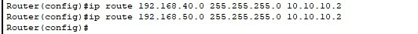
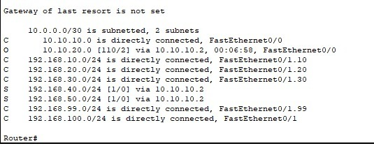
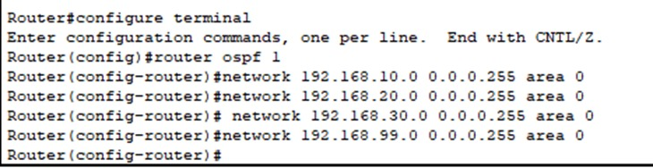
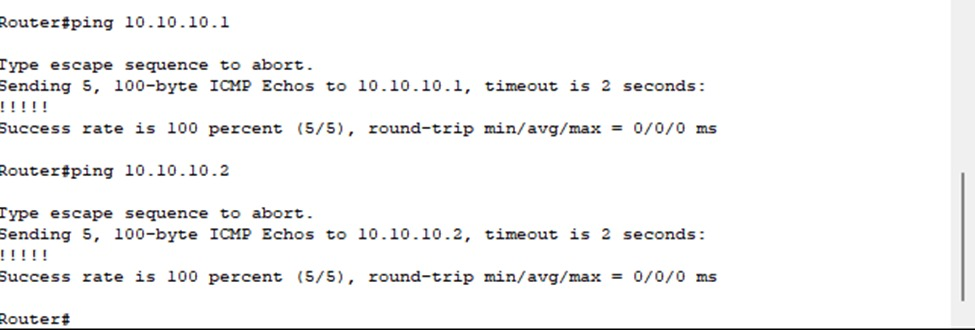
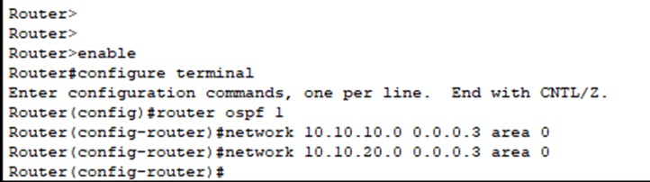
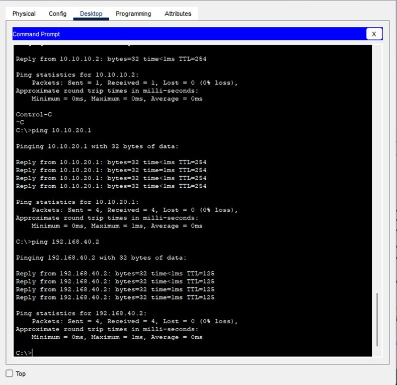
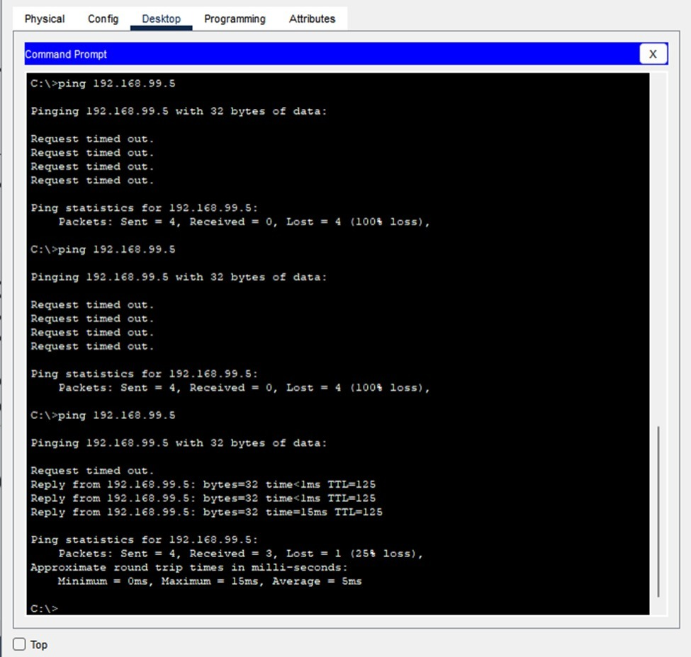

#  Pekan 12 Laporan Implementasi Routing & WAN

### 👥 Daftar Anggota dan Peran

| Nama Anggota     | NIM        | Peran                                        |
|------------------|------------|--------------------------------------------- |
| Az-Zahra Atikah Nurhaliza | 10231022 | Network Architect |
|Chintya | 10221078 | Network Engineer |
| Djaky Abbyyu Fauzan | 10231032 | Network Services Specialist |
| Djaky Abbyyu Fauzan | 10231032 | Network Security & Documentation Specialist |

##  Link File Simulasi
[Klik untuk membuka file simulasi Packet Tracer]
(Upload file `.pkt` Anda)

## Pendahuluan

Laporan ini mendokumentasikan implementasi routing statis dan dinamis (OSPF) untuk jaringan intra-gedung dan antar-gedung, serta simulasi koneksi WAN yang menghubungkan gedung-gedung tersebut. Implementasi dilakukan menggunakan Cisco Packet Tracer.


##  Routing Statis pada Jaringan Intra-Gedung
   

   penjelasan
```
ip route 192.168.40.0 255.255.255.0 10.10.10.2
ip route 192.168.50.0 255.255.255.0 10.10.10.2
```

Kedua perintah ini digunakan untuk membuat router mengetahui ke mana harus mengirim paket jika tujuannya ke jaringan 192.168.40.0 atau 192.168.50.0.
Tanpa perintah ini (jika tidak menggunakan OSPF atau routing dinamis lainnya), router tidak tahu rute ke jaringan tersebut dan akan drop paket.

Router diarahkan agar mengirim semua traffic menuju jaringan 192.168.40.0/24 melalui next-hop IP 10.10.10.2.

10.10.10.2 adalah IP dari router tetangga yang terhubung langsung (biasanya melalui antarmuka).


 ## hasil Router-IntraGedung2
  

  penjelasan

  O 10.10.10.0 [110/2] via 10.10.20.1

Jaringan 10.10.10.0/30 didapat dari OSPF

Dapat dicapai via IP 10.10.20.1

Nilai [110/2]: 110 adalah administrative distance OSPF, 2 adalah metric

C 10.10.20.0 is directly connected, FastEthernet0/0

Router langsung terhubung ke jaringan 10.10.20.0/30 melalui port Fa0/0

S 192.168.10.0 [1/0] via 10.10.20.1

Static route: jaringan 192.168.10.0/24 bisa diakses lewat 10.10.20.1

Angka [1/0]: admin distance 1, metric 0 (default untuk static)

S 192.168.20.0, S 192.168.30.0 → via 10.10.20.1

Sama seperti di atas, static route melalui IP tetangga

C 192.168.40.0 is directly connected, Fa0/1.40

Router ini memiliki koneksi langsung ke jaringan 192.168.40.0 melalui subinterface VLAN 40

C 192.168.50.0 is directly connected, Fa0/1.50

Koneksi langsung ke VLAN 50

S 192.168.99.0 via 10.10.20.1

Static route ke jaringan 192.168.99.0

O 192.168.100.0 [110/3] via 10.10.20.1

Jaringan 192.168.100.0/24 dikenali dari OSPF

Router ini memiliki kombinasi dari:

3 jaringan yang terhubung langsung

5 static routes (yang diarahkan ke 10.10.20.1)

2 OSPF routes (10.10.10.0 dan 192.168.100.0)

Routing sudah cukup lengkap dan tampaknya router berfungsi sebagai bagian dari jaringan dengan multiple VLAN dan protokol OSPF.


 ## Routing Dinamis OSPF Antar-Gedung
 Routing antar-gedung dilakukan menggunakan protokol dinamis OSPF (Open Shortest Path First) untuk mempermudah manajemen dan otomatisasi rute.


## OSPF Router-GedungA


```
Router> enable
Router# configure terminal
Router(config)# router ospf 1
Router(config-router)# network 192.168.10.0 0.0.0.255 area 0
Router(config-router)# network 192.168.20.0 0.0.0.255 area 0
Router(config-router)# network 192.168.30.0 0.0.0.255 area 0
Router(config-router)# network 192.168.99.0 0.0.0.255 area 0
```


## Penjelasan 
Penjelasan Baris per Baris:
Router(config)# router ospf 1
➤ Memulai proses OSPF dengan ID 1. Angka ini hanya penanda lokal dan bisa berbeda di router lain.

Router(config-router)# network 192.168.10.0 0.0.0.255 area 0
➤ Memasukkan jaringan 192.168.10.0/24 ke dalam proses OSPF, di area 0.
➤ Area 0 adalah area inti (backbone) wajib di OSPF.

network 192.168.20.0 0.0.0.255 area 0
➤ Sama seperti atas, jaringan 192.168.20.0/24 ikut didaftarkan ke OSPF.

network 192.168.30.0 0.0.0.255 area 0
➤ Menambahkan jaringan ketiga (192.168.30.0/24) ke OSPF area 0.

network 192.168.99.0 0.0.0.255 area 0
➤ Biasanya ini adalah jaringan antar-router (backbone link) atau WAN link antar gedung.
➤ Dengan menambahkan ini, router akan berbagi informasi rute antar-gedung melalui OSPF.


### UJI COBA OSPF GEDUNGF A


```
Router#show ip route ospf
10.0.0.0/30 is subnetted, 2 subnets
O    10.10.20.0 [110/2] via 10.10.10.2, 00:00:43, FastEthernet0/0
O    192.168.2.0 [110/3] via 10.10.10.2, 00:00:43, FastEthernet0/0
O    192.168.40.0 [110/3] via 10.10.10.2, 00:00:43, FastEthernet0/0

Router#ping 10.10.20.1
...
!!!!! (Success)
Router#ping 10.10.20.2
...
!!!!! (Success)
```

Router melakukan ping ke dua alamat IP remote: 10.10.20.1 dan 10.10.20.2.

Success rate 100% menunjukkan bahwa jalur routing OSPF berfungsi dengan baik dan router dapat menjangkau jaringan tersebut.

Nilai round-trip time = 0 ms menunjukkan respons sangat cepat, seperti yang diharapkan pada simulasi Packet Tracer.

## UJI COBA gedung A

```
Router#ping 10.10.10.1
Router#ping 10.10.10.2
Success rate is 100 percent (5/5)
round-trip min/avg/max = 0/0/0 ms
```
Penjelasan

ping digunakan untuk mengirim paket ICMP Echo Request ke IP tujuan, dan mengecek apakah IP tersebut merespons.

10.10.10.1 dan 10.10.10.2 adalah IP antarmuka router lain dalam topologi Anda (kemungkinan besar bagian dari jaringan WAN antar gedung).

Tanda !!!!! menunjukkan semua paket berhasil diterima oleh tujuan, tidak ada yang hilang.

Success rate 100% artinya koneksi antar-router berjalan baik.

Waktu round-trip 0/0/0 ms menunjukkan respon sangat cepat, karena simulasi dilakukan di Packet Tracer (bukan jaringan fisik nyata).


### OSPF ROUTER UTAMA

```
Router> enable
Router# configure terminal
Router(config)# router ospf 1
Router(config-router)# network 10.10.10.0 0.0.0.3 area 0
Router(config-router)# network 10.10.20.0 0.0.0.3 area 0
```
Penjelasan

10.10.10.0 dan 10.10.20.0 adalah jaringan yang ingin diiklankan ke OSPF.

0.0.0.3 adalah wildcard mask, ekuivalen dengan subnet mask /30 (255.255.255.252).

Digunakan karena jaringan ini adalah jaringan point-to-point antar-router, yang umum menggunakan /30.

area 0 berarti jaringan tersebut dimasukkan ke dalam Area 0, yaitu backbone OSPF.


## Fungsi Konfigurasi 
Router akan mengaktifkan OSPF di interface yang berada di jaringan 10.10.10.0/30 dan 10.10.20.0/30.

Router akan berbagi informasi routing ke router tetangga di jaringan tersebut.

Ini adalah bagian dari routing dinamis antar gedung (atau antar router) seperti yang diminta dalam tugas.


### SIMULASI WAN (DEPT IT GEDUNG A KE PC DEPT MARKETING GEDUNG B)

### Hasil Pengujian Konektivitas Antar-Gedung

Pengujian dilakukan dari PC menggunakan perintah `ping` ke beberapa IP tujuan:

- **10.10.10.2** → Router tetangga
- **10.10.20.1** → Router antar-gedung
- **192.168.40.2** → Host dari gedung lain

Semua pengujian menunjukkan hasil **berhasil (100% packet received)**. TTL yang bervariasi menunjukkan **OSPF berhasil memilih jalur routing** melalui router-router yang tersedia.

**Kesimpulan**: Implementasi routing dinamis (OSPF) berhasil dan konektivitas antar-gedung sudah teruji.

### SIMULASI WAN(PC DEPART MARKET KE SERVER GEDUNG A)



Penjelasan

Ping Pertama – 100% Packet Loss
python-repl
Salin kode
Request timed out.
...
Packets: Sent = 4, Received = 0, Lost = 4 (100% loss)
Makna: Semua paket tidak mendapat balasan. Ini bisa disebabkan oleh:

Perangkat dengan IP 192.168.99.5 belum aktif atau belum tersambung.

Jalur routing (misalnya OSPF) belum tersinkron sepenuhnya.

Firewall atau access list menghalangi ICMP reply.

 Ping Kedua – Masih 100% Packet Loss
python-repl
Salin kode
Request timed out.
...
Packets: Sent = 4, Received = 0, Lost = 4 (100% loss)
Makna: Kondisi masih sama. Perangkat mungkin sedang dalam proses booting atau OSPF belum selesai membangun routing table.

✅3. Ping Ketiga – Mulai Berhasil (75% Sukses)
python
Salin kode
Reply from 192.168.99.5: bytes=32 time<1ms TTL=125
...
Packets: Sent = 4, Received = 3, Lost = 1 (25% loss)
Makna:

Routing antar jaringan berhasil.

Host 192.168.99.5 sudah aktif dan merespon ping.

Ada satu paket yang hilang, kemungkinan karena:

Proses OSPF baru saja selesai sinkron.

Koneksi belum sepenuhnya stabil (baru aktif).