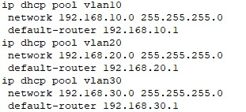
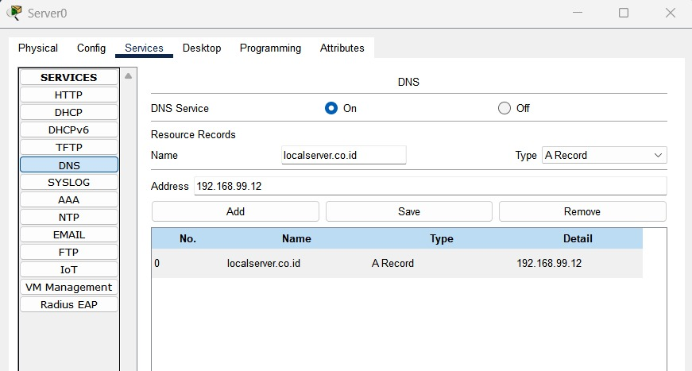
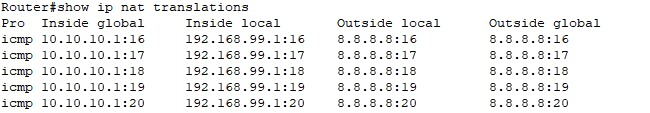

#  Pekan 13 Implementasi Layanan Jaringan

### 👥 Daftar Anggota dan Peran

| Nama Anggota     | NIM        | Peran                                        |
|------------------|------------|--------------------------------------------- |
| Az-Zahra Atikah Nurhaliza | 10231022 | Network Architect |
|Chintya | 10221078 | Network Engineer |
| Djaky Abbyyu Fauzan | 10231032 | Network Services Specialist |
| Djaky Abbyyu Fauzan | 10231032 | Network Security & Documentation Specialist |
---


### link file pkt
[Download file simulasi Packet Tracer]("C:\Users\User\Downloads\POJAN SEMESTER 4\DMJK\WEEK 13\topologi week 13 dhcp (1).pkt")

### Tujuan Implementasi
Layanan DHCP dan DNS diimplementasikan untuk memudahkan pengelolaan alamat IP secara dinamis dan penyelesaian nama (name resolution) di jaringan internal antar departemen. Dengan DHCP, setiap perangkat klien tidak perlu dikonfigurasi IP secara manual, sehingga lebih efisien dan meminimalkan kesalahan. DNS lokal juga membantu pemetaan domain internal yang relevan untuk masing-masing departemen agar komunikasi antar sistem lebih terstruktur.

---

### Konfigurasi DHCP dan DNS
Pada konfigurasi ini, setiap departemen memiliki subnet jaringan sendiri, default gateway yang spesifik, serta domain name internal masing-masing. Server DNS yang digunakan adalah publik (8.8.8.8) untuk menyederhanakan proses, namun bisa diganti dengan DNS lokal jika diperlukan di implementasi lanjutan.

---

### Konfigurasi DHCP Gedung A dan Gedung B

#### Gedung A (Departemen IT, Keuangan dan SDM )

```bash
ip dhcp pool vlan10
 network 192.168.10.0 255.255.255.0
 default-router 192.168.10.1

ip dhcp pool vlan20
 network 192.168.20.0 255.255.255.0
 default-router 192.168.20.1

ip dhcp pool vlan30
 network 192.168.30.0 255.255.255.0
 default-router 192.168.30.1
```
### link file

### Penjelasan
Gedung A melayani tiga VLAN untuk masing-masing departemen. Konfigurasi DHCP dipisahkan sesuai VLAN dan subnet-nya:

- VLAN 10 (IT) → 192.168.10.0/24

- VLAN 20 (Keuangan) → 192.168.20.0/24

- VLAN 30 (SDM) → 192.168.30.0/24

#### Gedung B (Departemen Marketing, Operasional)

```bash
ip dhcp pool vlan40
 network 192.168.40.0 255.255.255.0
 default-router 192.168.40.1

ip dhcp pool vlan50
 network 192.168.50.0 255.255.255.0
 default-router 192.168.50.1
 ```

### Penjelasan
Gedung B juga memiliki dua VLAN dengan pengaturan DHCP tersendiri:

- VLAN 40 (Marketing) → 192.168.40.0/24

- VLAN 50 (Operasional) → 192.168.50.0/24

---

### Konfigurasi DNS Server
Pada DNS server internal, dilakukan pemetaan antara nama domain lokal dengan alamat IP perangkat-perangkat penting di jaringan, seperti server file, aplikasi internal, atau printer.


### Penjelasan
Konfigurasi DNS dilakukan dengan membuat entri domain seperti web.lokal, keuangan.lokal, dan lainnya, yang dipetakan ke alamat IP server masing-masing departemen. Hal ini mempermudah pengguna dalam mengakses sumber daya jaringan menggunakan nama domain, bukan IP.

---

### Konfigurasi NAT

Perintah yang digunakan
```bash
Router# show ip nat translations
```

### Penjelasan
Output ini menunjukkan hasil translasi alamat IP dari jaringan internal ke IP publik menggunakan NAT. Contoh:

- Inside Local: 192.168.99.1:16 → alamat internal perangkat

- Inside Global: 10.10.10.1:16 → IP yang digunakan saat akses internet

- NAT berhasil menghubungkan perangkat ke 8.8.8.8 (DNS Google)

---

### Konfigurasi Routing dan NAT
##### Konfigurasi Routing Statis
Routing statis digunakan agar router dapat mengenali jalur menuju jaringan luar (biasanya internet) melalui gateway tertentu. Berikut adalah konfigurasi routing yang digunakan di beberapa router:

```bash
Router(config)# ip route 0.0.0.0 0.0.0.0 10.10.10.2
```

```bash
Router(config)# ip route 0.0.0.0 0.0.0.0 8.8.8.1
```

```bash
Router(config)# ip route 0.0.0.0 0.0.0.0 8.8.8.8
```

### Penjelasan
Ketiga perintah di atas merupakan contoh routing default (0.0.0.0 0.0.0.0) yang mengarahkan semua trafik yang tidak dikenali ke IP gateway tertentu (misalnya 10.10.10.2, 8.8.8.1, atau 8.8.8.8). Hal ini sangat penting agar perangkat dalam jaringan lokal bisa mengakses internet atau jaringan luar melalui satu pintu keluar.

---

### Konfigurasi NAT (Network Address Translation)
NAT digunakan agar perangkat dengan IP private di jaringan lokal dapat berkomunikasi ke jaringan publik (misalnya internet) dengan menerjemahkan alamat IP mereka.
```bash
Router(config)# interface fa0/1
Router(config-if)# ip nat inside
Router(config)# interface fa0/0
Router(config-if)# ip nat outside
Router(config)# access-list 1 permit 192.168.0.0 0.0.255.255
Router(config)# ip nat inside source list 1 interface fa0/0 overload
```

### Penjelasan
Penjelasan:

- Interface fa0/1 diatur sebagai inside, yaitu sisi jaringan lokal (LAN).

- Interface fa0/0 diatur sebagai outside, yaitu sisi yang terhubung ke luar (WAN/internet).

Setelah mendefinisikan interface inside dan outside, konfigurasi NAT biasanya dilanjutkan dengan membuat access list dan NAT overload agar IP private bisa diterjemahkan menjadi satu IP publik yang digunakan bersama.

---

