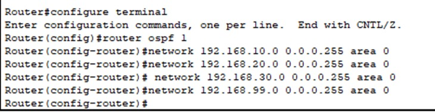
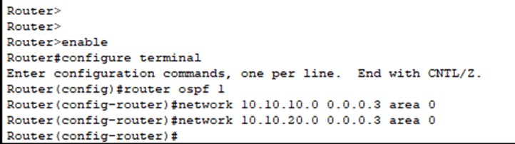
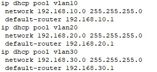
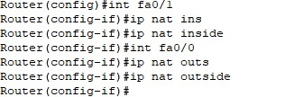
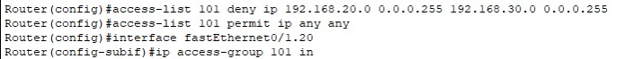

# Proyek Jaringan PT. Nusantara Network
## Pekan 15: Finalisasi Dokumentasi & Presentasi

## 👥 Daftar Anggota dan Peran

| Nama Anggota              | NIM        | Peran                                        |
|---------------------------|------------|----------------------------------------------|
| Az-Zahra Atikah Nurhaliza | 10231022   | Network Architect                            |
| Chintya                   | 10221078   | Network Engineer                             |
| Djaky Abbyyu Fauzan       | 10231032   | Network Services Specialist                  |
| Djaky Abbyyu Fauzan       | 10231032   | Network Security & Documentation Specialist  |

---

## Link file cisco
[Download file .pkt di sini](https://TopologiFinal.pkt)


## Daftar Isi
1. [Pendahuluan](#pendahuluan)  
2. [Isi Laporan](#isi-laporan)  
3. [Konfigurasi Perangkat](#konfigurasi-perangkat)  
4. [Screenshot dan Hasil Pengujian](#screenshot-dan-hasil-pengujian)  
5. [Kendala dan Solusi](#kendala-dan-solusi)  
6. [Kesimpulan](#kesimpulan)  
7. [Refleksi Kelompok](#refleksi-kelompok)  
8. [Dokumentasi CLI Semua Perangkat](#dokumentasi-cli-semua-perangkat)  
9. [Lampiran](#lampiran)

---

## Pendahuluan

Proyek ini bertujuan membangun jaringan enterprise untuk PT. Nusantara Network yang terdiri dari dua gedung (Gedung A & B), masing-masing memiliki beberapa departemen. Proyek mencakup desain topologi, pengalamatan IP, VLAN, routing, serta layanan DHCP, DNS, NAT, dan keamanan jaringan menggunakan ACL. Implementasi dilakukan menggunakan Cisco Packet Tracer.

---

## Isi Laporan

### Pekan 9 – Perencanaan Proyek & Desain Awal

- Analisis kebutuhan jaringan perusahaan  
- Identifikasi jumlah gedung dan departemen  
- Rancangan topologi kasar  
- Daftar perangkat yang dibutuhkan  

### Pekan 10 – Desain Topologi & Skema Pengalamatan

- Desain topologi logis dan fisik  
- Subnetting dan perencanaan IP menggunakan VLSM  
- Rencana VLAN, OSPF, NAT, dan ACL  

### Pekan 11 – Implementasi Topologi Dasar & VLAN

- Pembuatan VLAN & penamaan sesuai departemen  
- Konfigurasi trunk dan port access di switch  
- Routing antar-VLAN dengan metode router-on-a-stick  

### Pekan 12 – Implementasi Routing & WAN

- Routing statis dalam satu gedung  
- Routing dinamis antar gedung dengan OSPF  
- Uji ping antar router & host  

### Pekan 13 – Implementasi Layanan Jaringan

- DHCP: IP otomatis untuk tiap VLAN  
- DNS lokal dengan domain departemen  
- NAT overload untuk koneksi keluar  

### Pekan 14 – Keamanan dan Pengujian

- Implementasi ACL membatasi akses antar VLAN  
- Pengujian konektivitas seluruh VLAN  
- Troubleshooting & dokumentasi hasil ping

---

## Konfigurasi Perangkat

### ACL (Week 14 - Router Gedung A)
```bash
access-list 101 deny ip 192.168.20.0 0.0.0.255 192.168.30.0 0.0.0.255
access-list 101 permit ip any any
interface FastEthernet0/1.20
 ip access-group 101 in
````

### NAT (Week 13 - Router Internet)

```bash
interface fa0/1
 ip nat inside
interface fa0/0
 ip nat outside
access-list 1 permit 192.168.0.0 0.0.255.255
ip nat inside source list 1 interface fa0/0 overload
```

### DHCP (Week 12–13 - Router Gedung A & B)

```bash
ip dhcp pool vlan10
 network 192.168.10.0 255.255.255.0
 default-router 192.168.10.1
```

---

## Screenshot dan Hasil Pengujian

| Asal Departemen | Tujuan      | Hasil Ping | Keterangan                     |
| --------------- | ----------- | ---------- | ------------------------------ |
| IT              | Keuangan    | ✅ Sukses   | Routing & ACL memperbolehkan   |
| Marketing       | Keuangan    | ❌ Gagal    | Diblok oleh ACL                |
| IT              | Operasional | ✅ Sukses   | Routing lintas gedung berjalan |
| SDM             | Keuangan    | ✅ Sukses   | Akses diperbolehkan            |

---

## Kendala dan Solusi

| Masalah           | Penyebab                                | Solusi                                      |
| ----------------- | --------------------------------------- | ------------------------------------------- |
| ACL tidak bekerja | Belum diterapkan ke interface           | Tambahkan `ip access-group` ke subinterface |
| DHCP tidak aktif  | Gateway belum ditentukan                | Tambahkan `default-router` di DHCP Pool     |
| NAT gagal         | Interface belum ditandai inside/outside | Tambahkan konfigurasi NAT yang benar        |
| Keteteran jadwal  | Tugas matkul menumpuk                   | Bagi tugas dan komunikasi lebih efektif     |

---

## Kesimpulan

Fitur jaringan berhasil diimplementasikan: VLAN, routing (static & OSPF), DHCP, DNS, NAT, dan ACL. Semua pengujian menunjukkan sistem berjalan dengan optimal dan sesuai kebijakan keamanan.

---

## Refleksi Kelompok

Kami belajar pentingnya perencanaan jaringan, kolaborasi tim, troubleshooting konfigurasi, dan dokumentasi proyek. Proyek ini memperdalam pemahaman kami terhadap praktik nyata jaringan enterprise.

---

## Dokumentasi CLI Semua Perangkat

### VLAN & Router-on-a-Stick (Week 11)

#### Switch SW1

```bash
enable
configure terminal
vlan 10
 name IT
vlan 20
 name Keuangan
interface range fa0/1 - 10
 switchport mode access
 switchport access vlan 10
interface fa0/24
 switchport mode trunk
```

#### Router R1

```bash
interface FastEthernet0/1.10
 encapsulation dot1Q 10
 ip address 192.168.10.1 255.255.255.0
interface FastEthernet0/1.20
 encapsulation dot1Q 20
 ip address 192.168.20.1 255.255.255.0
```

---

### Routing (Week 12)

#### Static Routing


```bash
ip route 192.168.40.0 255.255.255.0 10.10.10.2
ip route 192.168.50.0 255.255.255.0 10.10.10.2
```

#### OSPF Routing




```bash
router ospf 1
 network 192.168.10.0 0.0.0.255 area 0
 network 192.168.20.0 0.0.0.255 area 0
 network 192.168.30.0 0.0.0.255 area 0
 network 10.10.10.0 0.0.0.3 area 0
 network 10.10.20.0 0.0.0.3 area 0
```

---

### DHCP & DNS (Week 13)



```bash
ip dhcp pool vlan10
 network 192.168.10.0 255.255.255.0
 default-router 192.168.10.1

ip dhcp pool vlan20
 network 192.168.20.0 255.255.255.0
 default-router 192.168.20.1
```

**DNS Mapping (Server Lokal):**

* `web.lokal` → 192.168.10.10
* `keuangan.lokal` → 192.168.20.10
* `sdm.lokal` → 192.168.30.10

---

### NAT (Week 13)



```bash
interface FastEthernet0/1
 ip nat inside
interface FastEthernet0/0
 ip nat outside
access-list 1 permit 192.168.0.0 0.0.255.255
ip nat inside source list 1 interface FastEthernet0/0 overload
```

---

### ACL (Week 14)



```bash
access-list 101 deny ip 192.168.20.0 0.0.0.255 192.168.30.0 0.0.0.255
access-list 101 permit ip any any
interface FastEthernet0/1.20
 ip access-group 101 in
```

---

### Perintah Pengujian Umum

Digunakan untuk memverifikasi konfigurasi NAT, VLAN, DHCP, dan konektivitas antar departemen.

```bash
ping 192.168.30.1
ping 8.8.8.8
show ip route
show vlan brief
show ip nat translations
show ip dhcp binding
```

---

## Lampiran

* [File Simulasi Packet Tracer Final](TopologiFinal.pkt)
* [Lihat video di Google Drive](https://drive.google.com/file/d/1BWfEHAtSivjCEjfkVWtBftvNZhL05WBT/view?usp=sharing)


* [Slide Presentasi Akhir](https://www.canva.com/design/DAGoJUsTbKE/jo-ysOrCmiW6tQ5NYazJSg/edit?utm_content=DAGoJUsTbKE&utm_campaign=designshare&utm_medium=link2&utm_source=sharebutton)
