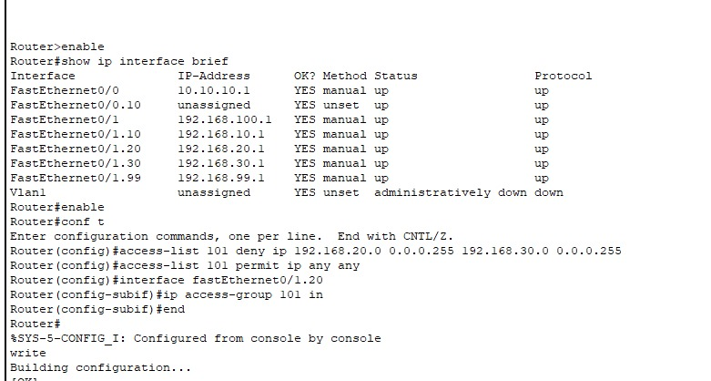

#  Pekan 14 Implementasi Keamanan & Pengujian

### 👥 Daftar Anggota dan Peran

| Nama Anggota     | NIM        | Peran                                        |
|------------------|------------|--------------------------------------------- |
| Az-Zahra Atikah Nurhaliza | 10231022 | Network Architect |
|Chintya | 10221078 | Network Engineer |
| Djaky Abbyyu Fauzan | 10231032 | Network Services Specialist |
| Djaky Abbyyu Fauzan | 10231032 | Network Security & Documentation Specialist |

---

##  Link File Simulasi
[Klik untuk membuka file simulasi Packet Tracer]

---

## 1. Implementasi Access Control List (ACL) Sesuai Kebijakan Keamanan

### Dokumentasi Konfigurasi ACL
```bash 
Router> enable
Router# show ip interface brief
Router# configure terminal
Router(config)# access-list 101 deny ip 192.168.20.0 0.0.0.255 192.168.30.0 0.0.0.255
Router(config)# access-list 101 permit ip any any
Router(config)# interface FastEthernet0/1.20
Router(config-subif)# ip access-group 101 in
Router(config-subif)# end
Router# write
```

### Penjelasan 
- ACL 101 digunakan untuk memblokir trafik dari jaringan 192.168.20.0/24 ke 192.168.30.0/24.

- Perintah permit ip any any memastikan trafik lain tetap diizinkan.

- ACL diterapkan secara inbound pada subinterface FastEthernet0/1.20.


---


## 2. Pengujian Menyeluruh Semua Fitur Jaringan
Pengujian dilakukan secara menyeluruh untuk memastikan semua fitur jaringan berjalan dengan baik, termasuk konektivitas antar departemen dan implementasi kebijakan keamanan menggunakan ACL.

### Tujuan Pengujian
- Memastikan bahwa semua host memperoleh IP otomatis dari DHCP.

- Memverifikasi bahwa semua subnet terhubung melalui routing yang benar.

- Menguji penerapan ACL dalam membatasi akses antar departemen, terutama ke Departemen Keuangan.

### Hasil Pnegujian Konektivitas

| No. | Asal Departemen | Tujuan Departemen | Hasil Ping | Keterangan                                           |
| --- | --------------- | ----------------- | ---------- | ---------------------------------------------------- |
| 1   | SD              | IT                | ✅ Sukses   | Routing antar subnet berhasil                        |
| 2   | SD              | Pemasaran         | ✅ Sukses   | Tidak dibatasi oleh ACL                              |
| 3   | SD              | Keuangan          | ✅ Sukses   | Akses diizinkan sesuai ACL                           |
| 4   | IT              | SD                | ✅ Sukses   | Routing berjalan normal                              |
| 5   | IT              | Pemasaran         | ✅ Sukses   | Tidak dibatasi oleh ACL                              |
| 6   | IT              | Keuangan          | ✅ Sukses   | Akses diizinkan sesuai ACL                           |
| 7   | Pemasaran       | SD                | ✅ Sukses   | Tidak dibatasi                                       |
| 8   | Pemasaran       | IT                | ✅ Sukses   | Tidak dibatasi                                       |
| 9   | Pemasaran       | Keuangan          | ❌ Gagal    | Akses diblok oleh ACL (192.168.20.0 ke 192.168.30.0) |

### Kesimpulan
- ACL berhasil diterapkan dan bekerja sesuai kebijakan, memblokir akses dari Pemasaran ke Keuangan.

- Trafik dari SD dan IT ke Keuangan tetap diperbolehkan.

- DHCP dan routing antar subnet berjalan normal tanpa gangguan.

### Matriks Pengujian Tambahan

| No. | Fitur Diuji               | Hasil      | Bukti Screenshot | Penjelasan                                                                       |
| --- | ------------------------- | ---------- | ---------------- | -------------------------------------------------------------------------------- |
| 1   | Konfigurasi ACL di Router | ✅ Berhasil | ✔️ (terlampir dibawah)   | Perintah `access-list` dan `ip access-group` berhasil dikonfigurasi tanpa error. |




---

## 3. Troubleshooting & Perbaikan Masalah
Beberapa kendala teknis sempat terjadi saat implementasi namun berhasil diselesaikan, di antaranya:

| Masalah                            | Analisis Penyebab                  | Solusi                                                     |
| ---------------------------------- | ---------------------------------- | ---------------------------------------------------------- |
| ACL awal tidak bekerja             | Belum diterapkan ke interface      | Menambahkan `ip access-group 101 in` ke subinterface       |
| Tidak ada respon ping antar subnet | Trafik diblok oleh ACL sesuai rule | Dikonfirmasi bahwa ini adalah **perilaku yang diinginkan** |

---

## Analisis Keamanan Jaringan
Access Control List (ACL) yang diterapkan berhasil meningkatkan keamanan jaringan dengan cara:

- Membatasi komunikasi antar subnet tertentu berdasarkan IP.

- Mengurangi potensi akses tidak sah antar departemen.

- Tetap memberikan fleksibilitas komunikasi bagi subnet yang diizinkan.

- Mendorong penerapan segmentasi jaringan yang lebih aman dan terkendali.